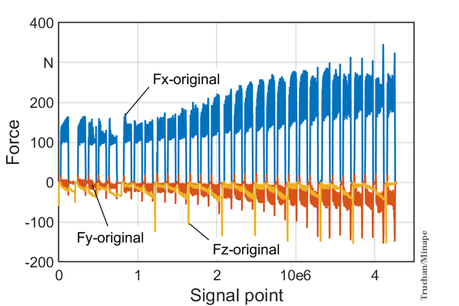

# Minape
Multimodal, Isotropic Neural Architecture with Patch Embedding for Recognition of Device State

The code used in the paper "Multimodal Isotropic Neural Architecture with Patch Embedding" ICONIP23.  
Official Minape repository: https://github.com/hubtru/Minape  
Official Mudestreda dataset: https://zenodo.org/records/8238653  
Conference paper: https://link.springer.com/chapter/10.1007/978-981-99-8079-6_14  
Mudestreda (MD) | Size 512 Samples (Instances, Observations)| Modalities 4 | Classes 3 |  
Future research: Regression, Remaining Useful Life (RUL) estimation, Signal Drift detection, Anomaly Detection, Multivariate Time Series Prediction, and Feature Engineering.

## Overview
* Task: Uni/Multi-Modal Classification 
* Domain: Industrial Flank Tool Wear of the Milling Machine
* Input (sample): 4 Images: 1 Tool Image, 3 Spectrograms (X, Y, Z axis)
* Output: Machine state classes: `Sharp`, `Used`, `Dulled`
* Evaluation: Accuracies, Precision, Recal, F1-score, ROC curve
* Each tool's wear is categorized sequentially: Sharp → Used → Dulled.
* The dataset includes measurements from ten tools: T1 to T10.
* Data splitting options include random or chronological distribution, without shuffling.
* Options: 
  * Original data or Augmented data
  * Random distribution or Tool Distribution 

## Table of Contents


  - [Introduction](#introduction)
  - [Installation](#installation)
  - [Usage](#usage)
  - [Data](#data)
  - [Results](#results)
  - [Interpretability](#interpretability)


## Introduction

Effective monitoring of device conditions and potential damage is critical in various industries, including manufacturing, healthcare, and transportation. Data collection from multiple sources poses a challenge in achieving accurate device state recognition due to its complexity and variability. To address this challenge, we propose the use of multimodal data fusion through the combination of modalities, utilizing the concentration phenomenon, to establish appropriate decision boundaries between device state regions. We introduce **Minape**, a novel supervised multimodal, isotropic neural architecture with patch embedding, which effectively describes device states.

### Overview


*Figure: A sample instance from Mudestreda that shows the importance of lever-
aging multimodal data for device state prediction.*


The **Minape** uses the linearly embedded patches of the grouped signals,
applies the isotropic architecture for representation retrieval, and uses TempMixer recurrent structure to map their temporal dependencies

In section [Data](#data) section we present tht **Mudestreda** : the publicly available and accessible multimodal device state recognition dataset as a new benchmark for multimodal industrial device state recognition.


<p align="center">

</p>


 The structure of the time series modality pathway.


The structure of the visual modality pathway.
<p align="center">
  
</p>


## Use Cases:  


| **Input**      | **Model**      | **Output**           |
|-----------------|---------------|-----------------------|
| **Use Cases:**            |                  |                                  |
| 4 Images (1 Tool Image, 3 Spectrograms (X, Y, Z)) | Classification Model       |  Class (Flank Tool Wear: `Sharp`, `Used`, `Dulled`)    |
| 3 Spectrograms (X,Y,Z axis)                       | Classification Model       |  Class (Flank Tool Wear)                               |
| 1 Tool Image                                      | Classification Model       | Image Class (Flank Tool Wear)                               |
| **Future Work:**                                  |                            |                                                       |
| [1, ..., 4] Images                                | Model                      | Remaining Useful Life (RUL) estimation                |
| [1, ..., 4] Images                                | Monitoring Model                      | Fault and Anomaly Detection                           |
| [1, ..., 4] Images                                | Forecasting Model                      | Multivariate Time Series Prediction                |
| [1, ..., 3] Spectrograms                          | Model                      | Signal Drift measurement                              |
| [1, ..., 4] Images                                | Regression Model           | Zero-Shot Flank Tool Wear (in µm, 10e-6 meter)        |
| [1, ..., 4] Images                                | Feature Engineering        | Diagnostic Feature Designer       


## Future Work


We aim to extend our research to Remaining Useful Life (RUL) estimation, considering the final observation of each tool (T1-T10) as the endpoint of its lifecycle. We also plan to explore fault and anomaly detection, treating the 'Dulled' class as an anomaly.

Our dataset design, with tools T1-T8 for training, T9 for validation, and T10 for testing, simulates zero-shot scenarios, challenging models to generalize to new, unseen conditions. This setup is vital for studying zero-shot learning and its industrial applications, like predictive tool wear adaptation.

Future endeavours will also focus on feature engineering, developing a Diagnostic Feature Designer app for feature importance assessment and selection. This includes extracting blade shapes from RGB tool images, segmenting flank wear, and processing time series data through various techniques like temporal window-based features, Fourier Transforms, Wavelet Transforms, Decomposition, Domain-Specific Features (e.g. RMS (Root Mean Square) Forces, Harmonic Analysis of signals, Spectral Kurtosis, Enveloping or Demodulation Techniques and Cross-Correlation Features.
 

We are also expanding the dataset to include additional modalities such as:
* Acoustic emission to monitor the sound emitted by the machinery,
* Temperature Monitoring as high temperatures can indicate excessive friction, 
* Power consumption that can be used to indicate the machine's efficiency,
* Torque and Load Analysis can reveal issues with the load on the machinery,
* Speed Variations may signal problems with tool wear,
* Contamination Levels of machining residues.

We are working on the multi-regression labels:
* Flank wear [µm],
* Gaps [µm],
* Overhang [µm],  
These additions aim to enrich the dataset for multivariate time series prediction, signal drift measurements, and precise flank tool wear estimation.


## Installation

Note that this work requires Python version 3.9 or later.

This scripts requires the following libraries to be installed:
 - pandas
 - numpy
 - matplotlib
 - seaborn
 - open-cv
 - tensorflow
 - tensorflow-addons
 - keras-tuner

To run .ipynb files you have to install Jupyter Notebook/JupyterLab.

In order to clone the repository to your local machine use this command
 ```bash
git clone https://github.com/hubtru/Minape.git
```

## Usage

To use this project, follow these steps:
1. Download the project files to your local machine.
2. Choose the script that you want to use.
 - iso_spec_aug_tooldist_opt.py train, optimize and save unimodal network for tool images. 
 - iso_tool_aug_tooldist_opt.py train, optimize and save unimodal network for spectrograms.
 - mult-reccurent_aug_tooldist.ipynb train multimodal network. This model uses transfer learning, by default it takes saved models from the "./models" folder. If you want to use your dataset, retrain unimodal networks first.
 - mult-reccurent_aug_tooldist--evaluation.ipynb evaluate model based on the demo dataset in the "./Data" folder.
3. If you want to use your dataset, update the file paths for labels and dataset folders in the script (Dataset acquisition cell).
4. Run the script in Jupyter Notebook or in Colab. 

For more information about how to use the Minape code with Mudestreda Dataset please visit dataset website: https://zenodo.org/records/8238653. 

## Minape Colab demo


| Type       | Signals                      | Colab Link | Description                   |
|------------|------------------------------|------------|-------------------------------|
| Multimodal | Tool images and Spectrograms | [](https://colab.research.google.com/github/hubtru/Minape/blob/main/jupyter%20notebooks/mult_reccurent_aug_tooldist_evaluation.ipynb) | Multimodal evaluation     
| Multimodal | Tool images and Spectrograms | [](https://colab.research.google.com/github/hubtru/Minape/blob/main/jupyter%20notebooks/mult_reccurent_aug_tooldist.ipynb) | Multimodal fine-tuning        | 
| Unimodal   | Tool images                  | [](https://colab.research.google.com/github/hubtru/Minape/blob/main/jupyter%20notebooks/iso_tool_aug_tooldist_opt.ipynb) | Unimodal tool images training |
| Unimodal   | Spectrograms                 | [](https://colab.research.google.com/github/hubtru/Minape/blob/main/jupyter%20notebooks/iso_spec_aug_tooldist_opt.ipynb) | Unimodal spectrograms training |


## Data
**Mudestreda**: Multimodal Device State Recognition Dataset

Link to complete dataset with detailed description: https://zenodo.org/records/8238653  

This section provides information about the data used in the project, including where it came from, how it was collected or generated, and any preprocessing or cleaning that was done.


### Data collection

<table>
    <tr>
        <td>
            <figure>
                
                <figcaption>Example of force signals (Fx, Fy, Fz) from tool nr. 1 (T1)</figcaption>
            </figure>
        </td>
        <td>
            <figure>
                
                <figcaption>Processing stage with the signal recording diagram</figcaption>
            </figure>
        </td>
    </tr>
</table>


Figure `signal.png` presents the force signals over 30 milling phases. After each phase, a picture of the tool was taken with an industrial microscope to determine its exact wear. A strong correlation between the tool wear and the force amplitudes can be observed, with the smallest amplitudes for the sharp tool increasing with tool wear.


### Data structure
The folder contains the pictures of the flank wear and the spectrograms of the forces in 3 axes (Fx, Fy, Fz).
 ```css
data/
│
├── Datassets/
│   ├── specX/
│   ├── specY/
│   ├── specZ/
│   └── tool/
│
└── Labels
```
## Results

This section provides a summary of the selection of the project results for the augmented data with the random split. Included are performance metrics and visualizations that were produced.


| Class  | Precision | Recall | F1-score |
| ------ | --------- | ------ | -------- |
| Sharp  | 1.00      | 1.00   | 1.00     |
| Used   | 1.00      | 0.95   | 0.97     |
| Dulled | 0.92      | 1.00   | 0.96     |


### Sensitivity Studies


*Figure: Effect of Minape hyperparameters on Mudestreda dataset.*

## Interpretability

### Visualizations of the total weights of the patch embedding layers in a Minape


*Figure: The total weights of the patch embedding layers in a Minape with a patch of 8 are visualized. While these layers essentially act as crude edge detectors, the industrial nature of the Mudestreda dataset prevents any discernible patterns from emerging. Interestingly, a number of filters bear a striking resemblance to noise, indicating the potential requirement for increased regularization.*

### Visualizations of the convolutional kernels


*Figure: The subset of depthwise convolutional kernels from last layer (layer 9) of the image pathaway Minape.*


*Figure: The subset of depthwise convolutional kernels from last layer (layer 9) of the timeseries pathaway Minape.*


### Visualization of the gradients


*Figure: Visual comparison of normal gradient and integrated gradient on a *dulled* tool blade image. The normal gradient and integrated gradient images offer pixel-wise and area-wise importance visualization, respectively.*

For more visualisation, see:  [Interpretability](interpretability/)


## Contributing

Pull requests are great. For major changes, please open an issue first to discuss what you would like to change.  
Please make sure to update tests as appropriate.

## Cite the Paper: 
@inproceedings{truchan2023multimodal,  
  title={Multimodal Isotropic Neural Architecture with Patch Embedding},  
  author={Truchan, Hubert and Naumov, Evgenii and Abedin, Rezaul and Palmer, Gregory and Ahmadi, Zahra},  
  booktitle={International Conference on Neural Information Processing},  
  pages={173--187},  
  year={2023},  
  organization={Springer}  
}  


## Cite the Dataset: 

@dataset{truchan_2024_8238653,  
  author       = {Truchan, Hubert and Admadi, Zahra},  
  title        = {{Mudestreda Multimodal Device State Recognition Dataset}},  
  month        = jan,  
  year         = 2024,  
  publisher    = {Zenodo},  
  doi          = {10.5281/zenodo.8238653},  
  url          = {https://doi.org/10.5281/zenodo.8238653}  
} 

## License
The project is released under MIT license. 


