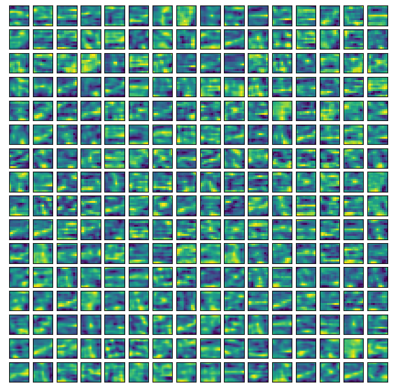
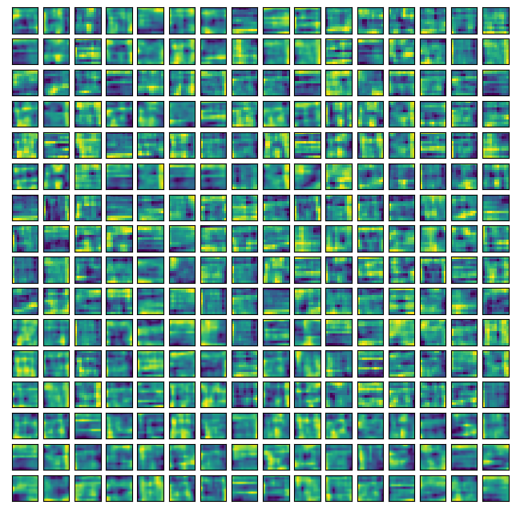

## The subset of depthwise convolutional kernels from progressively deeper layers of the image pathaway Minape

*Layer 1*

*Layer 2*

*Layer 3*

*Layer 4*

*Layer 5*

*Layer 6*

*Layer 7*

*Layer 8*

*Layer 9*

*Figure: The subset of depthwise convolutional kernels from progressively deeper layers of the image pathaway.*

---
## The total weights of the patch embedding layers in a Minape with a patch of 8

*Figure: The total weights of the patch embedding layers in a Minape with a patch of 8 are visualized. While these layers essentially act as crude edge detectors, the industrial nature of the Mudestreda dataset prevents any discernible patterns from emerging. Interestingly, a number of filters bear a striking resemblance to noise, indicating the potential requirement for increased regularization.*

---
## The subset of depthwise convolutional kernels from progressively deeper layers of the timeseries pathaway Minape

*Layer 1*

*Layer 2*

*Layer 3*

*Layer 4*

*Layer 5*

*Layer 6*

*Layer 7*

*Layer 8*

*Layer 9*

*Figure: The subset of depthwise convolutional kernels from progressively deeper layers of the timeseries pathaway Minape.*

---

